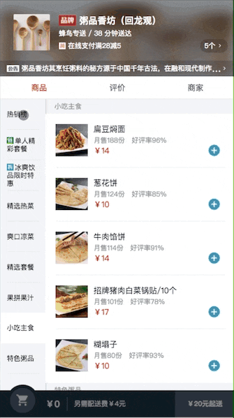
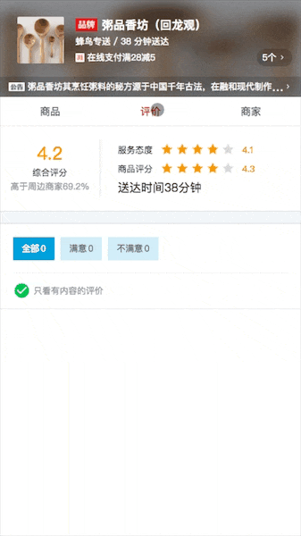
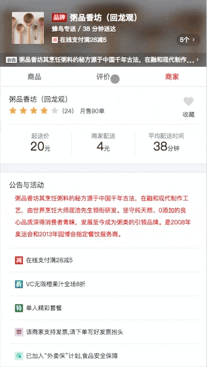
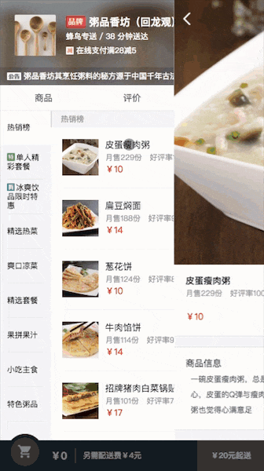

# 饿了么外卖 React版本

### 起因

2017年刚入行的时候在慕课网学习了vue高仿饿了么项目。

从那时起跟随黄老师的脚步打开了MVVM框架的大门。

在工作中，主要技术栈还是用vue。

但本人对于react十分憧憬，工作之余常常翻阅react文档，写写demo。

由于工作中使用react技术栈实在太少，遂决定找找react相关项目练手。

看到市面上众多vue高仿xxxAPP  react高仿xxxAPP  遂决定用react实现一下饿了么外卖。

也算是检验下对于黄老师这门课程的学习成果。

### 项目启动

`npm i`

`npm start`

打开本地端口`0.0.0.0:8099`

### 作品展示
[在线演示](https://hq-lin.github.io/react-sell/dist/#/goods)

### 关于代码、资源、项目搭建

本项目使用sass + react + react-router + axios

问：“为什么不用redux？”

答：“此项目难度为初级，使用react自带的context足矣”

资源方面是用慕课上vue高仿饿了么项目的资源。

项目搭建这块，本来想的是使用官方的create-react-app模版。

后来感觉使用起来不太自由，不好定制，于是就用自己搭建的环境开发。

搭建项目可以查看我的一篇个人博客 => [手把手教你搭建react环境](https://segmentfault.com/a/1190000011824338)

### 关于
此项目难度很低但也涵盖了react开发中常见的开发场景,十分适合用来入门学习

感兴趣的同学可以自行clone查看源码(应该很容易看懂^_^)

### 传送门

[正版vue高仿饿了么项目](https://github.com/ustbhuangyi/vue-sell)

### 感谢

喜欢的同学可以顺手给个star支持一下，谢谢！！
